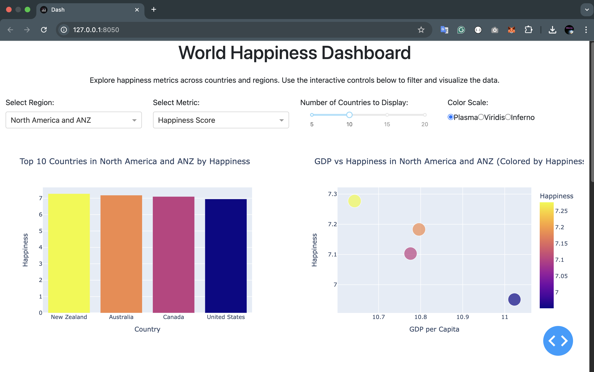
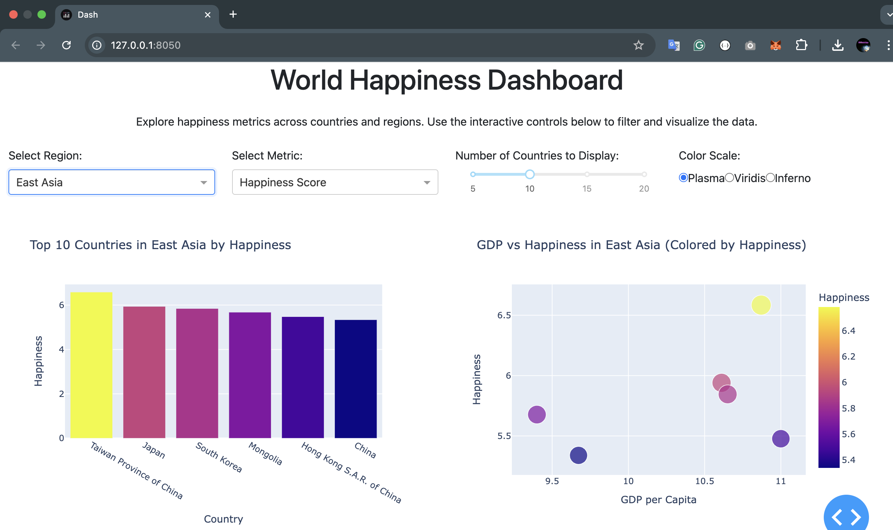
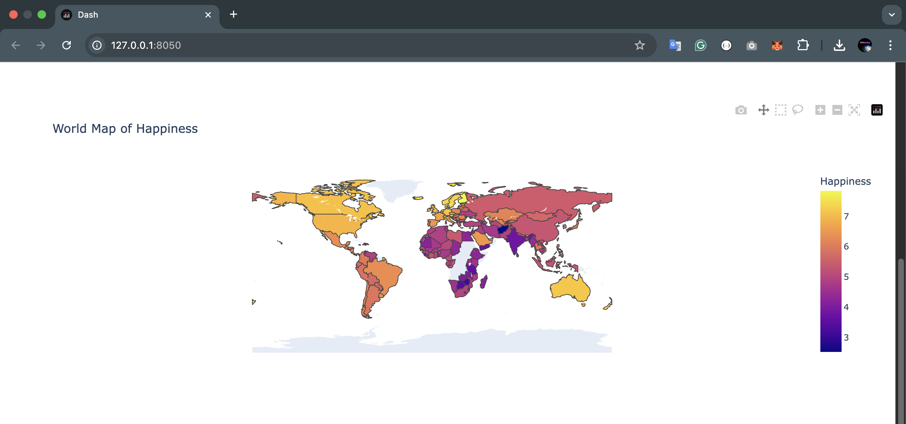
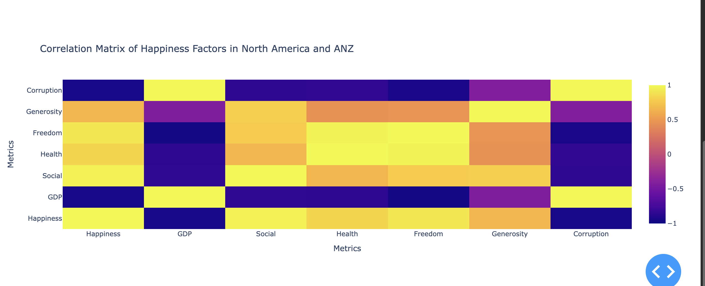

# World Happiness Dashboard

An interactive Dash application for exploring the World Happiness Report data.

## Features

- Interactive visualizations including bar charts, scatter plots, choropleth maps, and correlation heatmaps
- Filter data by region and happiness metrics
- Adjust number of countries displayed
- Customize color scales

## Data Source

The dataset comes from the World Happiness Report 2021, available on Kaggle:
[https://www.kaggle.com/ajaypalsinghlo/world-happiness-report-2021](https://www.kaggle.com/ajaypalsinghlo/world-happiness-report-2021)

## Screenshots

## Installation

1. Clone this repository
2. Install the required packages: `pip install -r requirements.txt`
3. Run the application: `python app.py`
4. Access the dashboard at `http://127.0.0.1:8050/`

## Usage

1. Use the region dropdown to select a geographic region
2. Choose which happiness metric to visualize
3. Adjust the slider to control how many countries are displayed
4. Select different color scales for the visualizations
5. Explore the relationships between different happiness factors
